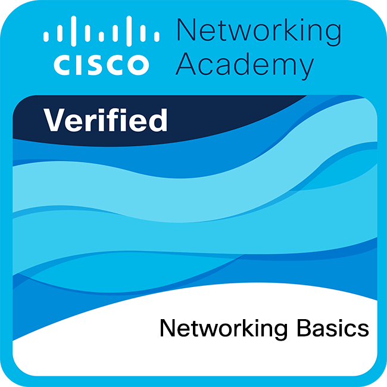

    <h2 align="center"> 🔎Knowledge📖 </h2>

    

        I worked using Jupyter Notebook for data analysis and AI focusing on social networks applying graphs theory. Nowdays, I focus on mobile develoment as Kotlin and Swift, also I get some badge about CCNA so I love cyber security.
        So I do my best in every specialtation area. My programming languages are Swift, C/C++, Python, Kotlin, Shell Script, and 
        little bit of CSS and Java Script. In other hand, My knowledge languages are Spanish (Native), English (B2 ~ C1), French (A2),
        German (A1), Japanese (N5 ~ N4). Check my repositories and give your opinion I'll do my best and be better every day. Finally, I love watching anime. 
         
    

    

         
    

 
 
 

    <h2 align = "center"> 🏆 My Badges </h2>

    
    
    
    
    
    

 
 
 

<h2 align = "center"> 📉 GitHub Stats</h2>

 
        
        
        <a href="https://github.com/vn7n24fzkq/github-profile-summary-cards">
            
    

 
 

